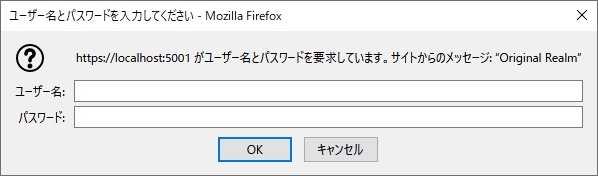
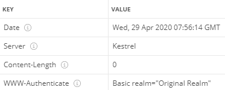

### :octocat: ASP.NET CoreでRESTful API(JSON)、HTTPS通信サンプル
___
#### 環境
```
開発環境：Microsoft Visual Studio 2019 Community Edition 16.8.1  
フレームワーク：ASP.NET Core 5.0.0  
デベロッパーパック：.NET Core SDK 5.0.100  
Webサーバー：Kestrel  
言語：C#.NET 8.0    
データベース：Microsoft SQL Server 2019 Express CU8  
-データベース管理ツール：Microsoft SQL Server Management Studio 18.7.1  
データベース接続：.NET Framework Data Provider for SQL Server  
O/R マッパー：Entity Framework Core SQLServer 5.0.0  
ログイン認証：Basic(基本)認証  
```

#### Basic認証／ブラウザ  


#### Basic認証／401レスポンスヘッダー例  
